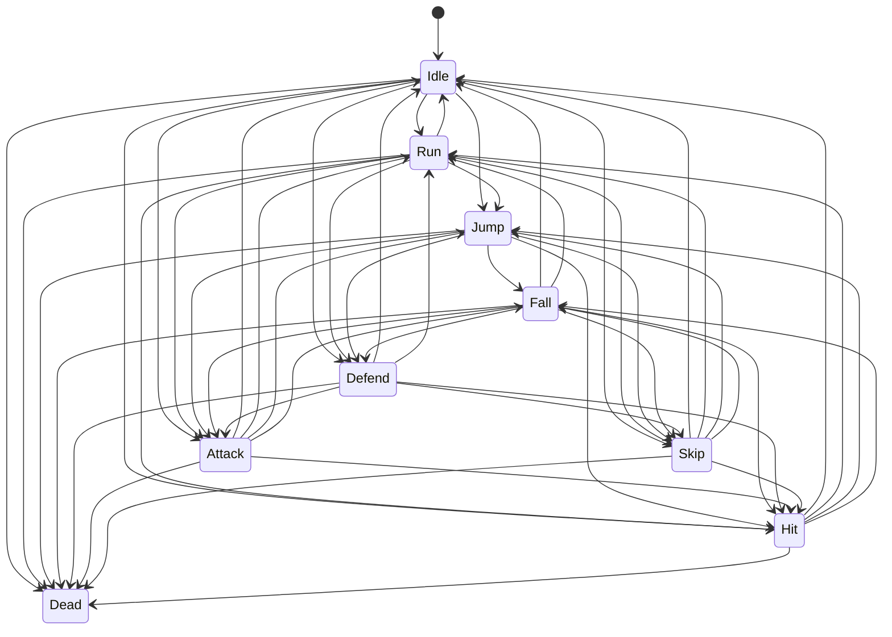

# Player State Machine (Generated)

`PlayerStateMachine` lives at `Assets/Scripts/player/PlayerStateMachine.cs`.

## States

- `Idle`
- `Run`
- `Jump`
- `Fall`
- `Defend`
- `Attack`
- `Skip`
- `Hit`
- `Dead`

## Evaluation Priority (high -> low)

1. `Dead`
2. `Hit`
3. `Skip`
4. `Attack`
5. `Defend`
6. `Jump` / `Fall`
7. `Run`
8. `Idle`

## Transition Source

- Combat states come from `PlayerCombat` flags:
  - `IsDead`
  - `IsHitStunned`
  - `IsSkipping`
  - `IsAttacking`
  - `IsDefending`
- Locomotion states come from `PlayerController2D`:
  - `IsGrounded`
  - `Velocity`
  - `MoveInput`

## Diagram

